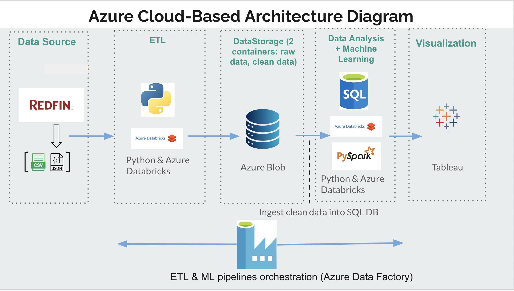
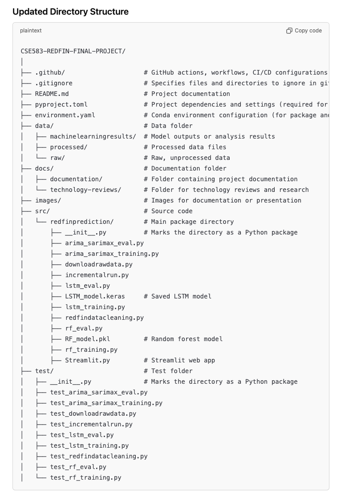
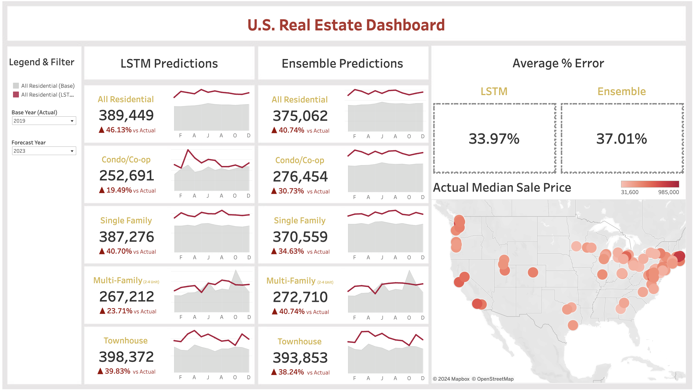

# RedfinPredict: Real Estate Sales Pricing Forecast

**RedfinPredict** is a tool that provides real-time predictions of median sale prices for homes in popular U.S. cities, based on data from Redfin’s housing market. It visualizes price trends from 2019 to the present and offers dynamic insights to track and forecast housing market movements. The tool supports two machine learning methods, allowing users to compare and select the best approach for accurate predictions.

## Mission

Our mission is to empower homebuyers, investors, and real estate agents with real-time, data-driven insights into housing market trends. By leveraging Redfin’s comprehensive market data and advanced machine learning models, users can visualize price trends and compare two predictive approaches, enabling them to navigate price fluctuations and make informed decisions.

## Project Objective

Understanding the trend of median sale prices is crucial for homebuyers, investors, and real estate agents. Real estate prices are influenced by various factors, including economic conditions and housing features. This tool helps users:

- Easily visualize and track price trends.
- Make informed decisions with accurate sales price predictions.
- Navigate the complexities of a rapidly changing housing market.

RedfinPredict addresses the challenge of manually tracking and interpreting market trends by providing a real-time dashboard that tracks median sale price trends in popular U.S. cities. It uses machine learning models to offer accurate forecasts, allowing users to predict future price movements and choose the most reliable prediction model.

## Repository Structure

The final project directory consists of the following main subdirectories:

- **`data/`**: Contains raw data, cleaned data, and predictions.
- **`docs/`**: Holds the technology review files.
- **`src/redfinprediction`**: Includes code for the ETL pipeline, data processing, and machine learning model training and testing (Streamlit app).
- **`test/`**: Contains unit tests for the ETL pipeline and machine learning modules.

## Architecture Diagram

Here is the architecture diagram for the RedfinPredict project, designed for deployment on Azure Cloud. Initially, we planned to explore cloud computing with Azure, but due to resource limitations (restricted CPU and memory in the free-tier program), we decided to switch to using our local servers and GitHub for the project's deployment.

**Azure Cloud Approach:**

**Local Server Approach and GitHub Folder Structure:**

The project can be split into the following areas:

1. **Data Extraction**: Data is collected from Redfin’s website. Inside the `src/redfinprediction` folder, the `downloadrawdata.py` file is used to extract raw data and store it in the `data/raw` folder. This script should be run every month to get the latest Redfin data, as it's updated monthly.

2. **Data Cleaning**: Missing values, duplicates, and inconsistencies are handled. Inside the `src/redfinprediction` folder, `redfindatacleaning.py` is used for **initial** data cleaning and loading into the `data/processed` folder. After that, `incrementalrun.py` will handle incremental loading based on the last date (e.g., period end) of the previous run.

3. **Storage**: Cleaned data is uploaded to the GitHub `data` folder.

4. **Machine Learning Models**: Four models (Ensemble, LSTM, ARIMA, SARIMAX) analyze the data and generate predictions.

5. **Visualization**: The results are visualized in **Tableau**, where interactive dashboards allow stakeholders to explore trends, compare model predictions, and track performance.

## Machine Learning Methods

The tool employs four machine learning methods to predict median sale prices:

- **Ensemble (Random Forest)**: Robust to overfitting, handles non-linear relationships, reduces noise by aggregating multiple decision trees, and identifies important features that impact property values.
- **LSTM (Long Short-Term Memory)**: Models temporal dependencies and long-term trends in time-series data, capturing complex, non-linear relationships from historical data and external variables for more accurate predictions.
- **ARIMA (AutoRegressive Integrated Moving Average)**: Effective for short-term predictions based on univariate data. It captures underlying trends but is less suited for incorporating external variables compared to more advanced models.
- **SARIMAX (Seasonal Autoregressive Integrated Moving Average with Exogenous Regressors)**: Advanced model that captures trends, cycles, seasonal patterns, and external factors, making it a more comprehensive forecasting tool for predicting future median sale prices.

### Model Performance

| **ML Methods**  | **Ensemble**  | **LSTM**      | **ARIMA**     | **SARIMAX**   |
|-----------------|---------------|---------------|---------------|---------------|
| **MAE**         | 57,603.67     | 62,258.11     | 191,723.41    | 194,247.94    |
| **R-Squared**   | 0.82          | 0.85          | -0.04         | -0.02         |

- **Best models**: Ensemble and LSTM, with the lowest MAE and highest R-squared score.

## Usage

### For Technical Users

1. Clone the repository and set up the environment by installing the dependencies listed in `pyproject.toml`.
2. Run `downloadrawdata.py` to fetch data from Redfin’s website.
3. Perform data cleaning by running `redfindatacleaning.py` once, and use `incrementalrun.py` for subsequent data refreshes.
4. After the ETL process, you can run the machine learning models (Ensemble, LSTM, ARIMA, SARIMAX), fine-tune them by adjusting hyperparameters, and evaluate performance using metrics like MAE and R-squared.
5. The results are visualized in Tableau, where you can compare model predictions and track performance over time.

### For Non-Technical Users

1. Visit the interactive dashboard to select your desired time frame.
2. The tool will display predicted median home sale prices along with historical data trends.
3. You can also compare different predictive models and gain insights into real estate market trends.

**Dashboard Preview:**

View machine learning predictions interactive dashboard by clicking the image above or following this [link](https://bit.ly/cse583project).
View historical trends interactive dashboard by clicking on this [link](https://public.tableau.com/views/Book2_17339412137430/Dashboard1?:language=en-US&:sid=&:redirect=auth&:display_count=n&:origin=viz_share_link)

## Use Cases

- **Homebuyers, Real Estate Investors, and Agents**: Predict future home prices, track trends, and make data-driven decisions for buying or selling properties.
- **Data Scientists**: Refine and enhance machine learning models to ensure the tool delivers the most accurate predictions for users.

## Requests

RedfinPredict aims to provide accurate, up-to-date predictions for real estate prices across various markets. To request additional cities or regions, suggest new features, or propose improvements, please open an issue.

## Team Contributions

- **Kuan-Wei (Rome) Lin**:  
  - Project Manager  
  - Researched and conducted test runs using Azure Cloud Computing.
  - Designed and implemented the ETL pipeline (downloadrawdata.py, redfindatacleaning.py, incrementalrun.py) and 3 corresponding unit tests.
  - Designed and made the historical trend Tableau dashboard.  

- **Hongfan Lu**:  
  - Developed and fine-tuned ARIMA and SARIMAX models (arima_sarimax_training.py, arima_sarimax_eval.py) for time series forecasting, including corresponding unit tests.  
  - Organized models on Streamlit (Streamlit.py) for comparison of prediction accuracy.  
  - Code Review, setup of `toml` and `yml` files, and functions documentation.

- **Aishwary Jadhav**:  
  - Handled data manipulation.  
  - Built an ensemble model using Random Forest (rf_training.py, rf_eval.py) and performed feature importance analysis, with corresponding unit tests.

- **Maitreyi Ekbote**:  
  - Designed and trained the LSTM model (lstm_training.py, lstm_eval.py) for advanced time series forecasting, with corresponding unit tests.

- **Ching-Ping (CP) Chan**:  
  - Set up CI.  
  - Designed and made the machine learning predictions Tableau dashboard.  
  - Created README documentation.

## Challenges and Future Work

### Challenges

- **Cloud Deployment Limitations**: We initially planned to deploy the project on Azure Cloud, but we faced resource limitations, particularly with the free-tier services, which restricted the use of powerful machine learning models. This caused a delay in the planned cloud-based deployment and led to switching to local servers for processing.

- **Machine Learning Approach and Output**: Currently, our machine learning models' outputs require manual adjustments to consolidate the predictions into a single file, final_ML_prediction_for_plotting.csv, for plotting and visualization. This is mainly due to inconsistencies in the output formats across different models.

### Future Work

- **Improved Cloud Deployment**: We plan to revisit cloud deployment options with increased resources, either by upgrading the free-tier Azure account or exploring other cloud platforms, to fully leverage scalable compute for more complex models.

- **Model Enhancement and Tuning**: We plan to address the current challenge of inconsistent output formats across models by automating the consolidation of prediction outputs. To improve prediction accuracy, we will explore and test additional models and gather more diverse data for training, as our current best model still has over 30% error. This will help us refine the models and potentially reduce prediction error.

- **User Experience Improvements**: Enhancing the Tableau dashboard with additional interactive features (e.g., city-specific data filters, predictive comparison charts) could improve user experience, especially for non-technical users.
