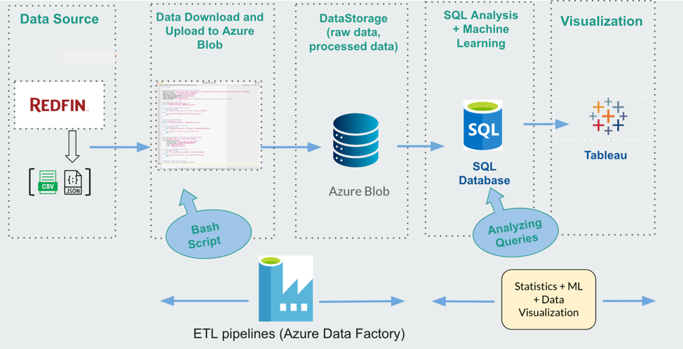

# RedfinPredict: Real Estate Sales Pricing Forecast

RedfinPredict is a tool that provides real-time predictions of median sale 
prices for homes in popular U.S. cities, based on data from Redfin’s 
housing market. It visualizes price trends from 2019 to the present and 
offers dynamic insights to track and forecast housing market movements. 
The tool supports two machine learning methods, allowing users to compare 
and select the best approach for accurate predictions.

## Mission

Our mission is to empower homebuyers, investors, and real estate agents 
with real-time, data-driven insights into housing market trends. By 
leveraging Redfin’s comprehensive market data and advanced machine 
learning models, users can visualize price trends and compare two 
predictive approaches, enabling them to navigate price fluctuations and 
make informed decisions.

## Project Objective

Understanding the trend of median sale prices is crucial for homebuyers, 
investors, and real estate agents. Real estate prices are influenced by 
various factors, including economic conditions and housing features. This 
tool helps users:

- Easily visualize and track price trends.
- Make informed decisions with accurate sales price predictions.
- Navigate the complexities of a rapidly changing housing market.

RedfinPredict addresses the challenge of manually tracking and 
interpreting market trends by providing a real-time dashboard that tracks 
median sale price trends in popular U.S. cities. It uses machine learning 
models to offer accurate forecasts, allowing users to predict future price 
movements and choose the most reliable prediction model.

## Repository Structure

The final project directory consists of the following main subdirectories:

- **`data/`**: Contains raw data, cleaned data, and predictions.
- **`docs/`**: Holds the technology review files.
- **`src/`**: Includes code for the ETL pipeline, real-time data 
processing, and machine learning model comparisons (Streamlit app).
- **`tests/`**: Contains unit tests for the ETL pipeline and machine 
learning code.

## Architecture Diagram

Below is the architecture diagram of the RedfinPredict project.

The project follows an automated ETL pipeline architecture:

1. **Data Extraction**: Data is collected from Redfin’s data center.
2. **Data Cleaning**: Missing values, duplicates, and inconsistencies are 
handled automatically.
3. **Storage**: Cleaned data is uploaded to **Azure Blob Storage**.
4. **Machine Learning Models**: Four models (Ensemble, LSTM, ARIMA, 
SARIMAX) analyze the data and generate predictions.
5. **Visualization**: The results are visualized in **Tableau**, where 
interactive dashboards allow stakeholders to explore trends, compare model 
predictions, and track performance.

## Machine Learning Methods

The tool employs four machine learning methods to predict median sale 
prices:

- **Ensemble (Random Forest)**: Robust to overfitting, handles non-linear 
relationships, reduces noise by aggregating multiple decision trees, and 
identifies important features that impact property values.
- **LSTM (Long Short-Term Memory)**: Models temporal dependencies and 
long-term trends in time-series data, capturing complex, non-linear 
relationships from historical data and external variables for more 
accurate predictions.
- **ARIMA (AutoRegressive Integrated Moving Average)**: Effective for 
short-term predictions based on univariate data, captures underlying 
trends, but less suited for incorporating external variables compared to 
more advanced models.
- **SARIMAX (Seasonal Autoregressive Integrated Moving Average with 
Exogenous Regressors)**: Advanced model that captures trends, cycles, 
seasonal patterns, and external factors, making it a more comprehensive 
forecasting tool for predicting future median sale prices.

### Model Performance

| ML Methods | Ensemble  | LSTM      | ARIMA     | SARIMAX   |
|------------|-----------|-----------|-----------|-----------|
| **MAE**    | 57,603.67 | 62,258.11 | 191,723.41| 194,247.94|
| **R-Squared** | 0.82    | 0.85      | -0.04     | -0.02     |

- **Best models**: Ensemble and LSTM, with the lowest MAE and highest 
R-squared score.

## Usage

## For Tech Individuals

To get started, clone the repository and set up the environment. The ETL 
pipeline is fully automated: it collects data from Redfin’s data center, 
processes it, and stores it in Azure Blob Storage. You can run models 
locally or on a cloud platform (Ensemble, LSTM, ARIMA, SARIMAX), fine-tune 
them by adjusting hyperparameters, and evaluate performance using metrics 
like MAE and R-squared. Visualization is available in Tableau, where you 
can compare model predictions and track performance over time.

## For Non-Tech Individuals

Visit the interactive dashboard to select your desired time frame. The 
tool will display predicted median home sale prices along with historical 
data trends. You can also compare different predictive models and gain 
insights into real estate market trends.

## Use Cases

- **Homebuyers, Real Estate Investors, and Agents**:  
  Predict future home prices, track trends, and make data-driven decisions 
for buying or selling properties.

- **Data Scientists**:  
  Refine and enhance machine learning models to ensure the tool delivers 
the most accurate predictions for users.

## Requests

RedfinPredict aims to provide accurate, up-to-date predictions for real 
estate prices across various markets. To request additional cities or 
regions, suggest new features, or propose improvements, please open an 
issue.

## Team Contributions

- **Kuan-Wei (Rome) Lin**:  
  - Project Manager  
  - Designed and implemented the ETL pipeline, including data cleaning, 
preprocessing, and unit tests.

- **Hongfan Lu**:  
  - Developed and fine-tuned ARIMA and SARIMAX models for time series 
forecasting, including corresponding unit tests.  
  - Organized models on Streamlit for comparison of prediction accuracy.  
  - Code Review, setup of `toml` and `yml` files, and functions 
documentation.

- **Aishwary Jadhav**:  
  - Handled data manipulation.  
  - Built an ensemble model using Random Forest and performed feature 
importance analysis, with unit tests.

- **Maitreyi Ekbote**:  
  - Designed and trained the LSTM model for advanced time series 
forecasting, with unit tests.

- **Ching-Ping (CP) Chan**:  
  - Set up CI.  
  - Designed the Tableau dashboard.  
  - Created README documentation.

---
